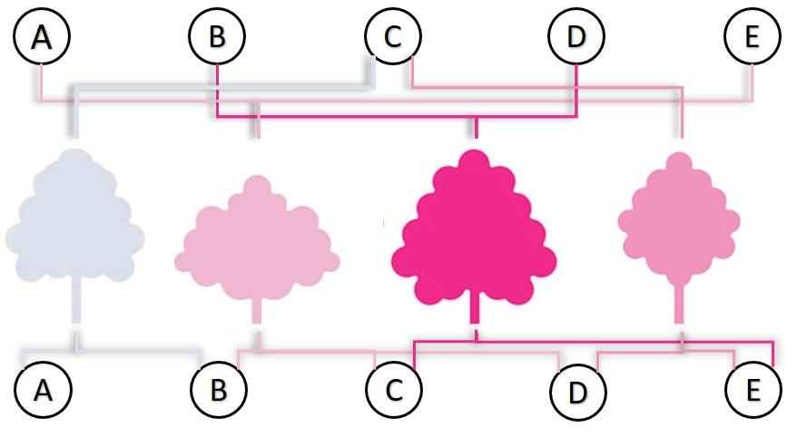
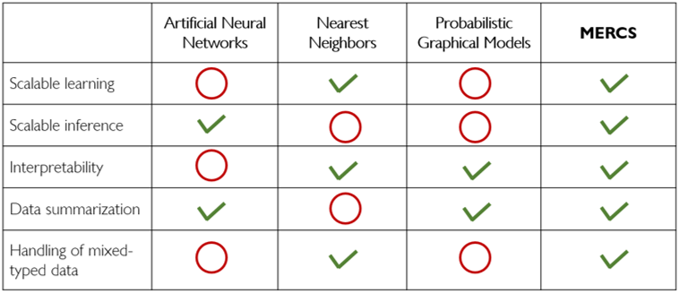
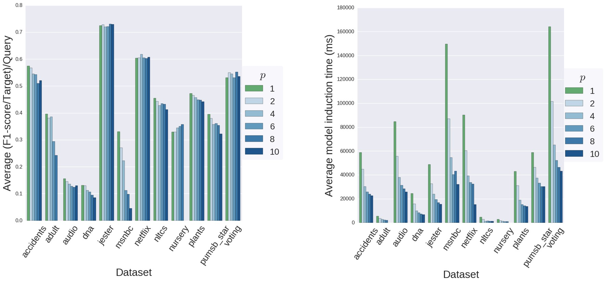



This post is based on the following publications:

- [MERCS: Multi-Directional Ensembles of Regression and Classification Trees](https://www.aaai.org/ocs/index.php/AAAI/AAAI18/paper/viewFile/16875/16735). 
Elia Van Wolputte, Evgeniya Korneva, Hendrik Blockeel. The Thirty-Second AAAI Conference on Artificial Intelligence. New Orleans, 2018.
- **TODO: Add others, if needed** 

You can find MERCS code and documentation [on GihHub](https://eliavw.github.io/mercs-v5/)



In supervised machine learning, models are typically *uni-directional*, meaning that they predict some fixed set of targets Y from a set of inputs X. Think of, for example, predicting flight ticket prices for the next couple of days (Y) given those from the previous week (X) or classifying dog's breed (Y) on an photo (X). 

However, in practice, all of the prediction tasks of potential interest sometimes cannot be formulated upfront. For instance, imagine working with the data containing readings from several sensors over time. Every now and then, some sensor fails and the corresponding reading is missing. One then needs to predict the missing values from the available ones. 

Note that in the example above, the sets of available and missing readings are different every time. To avoid training new specialized machine learning model each time a new task needs to be solved, it is convenient to have a *multi-directional* model at hand that, when trained, would be able to solve any random prediction task.

In this article, we introduce MERCS - a novel class of multi-directional models based on decision trees. We will describe MERCS in detail and show how such a model can be used for anomaly detection and missing value imputation.

## What is MERCS

MERCS stands for **M**ulti-directional **E**nsemble of **R**egression and **C**lassification tree**S** and essentially extends well-known random forests towards multi-directional prediction by constructing ensembles of decision trees that have different sets of input and output variables. 

For instance, consider a dataset with five attributes, namely *A, B, C, D* and *E*. In an example below, a MERCS ensemble contains four decision trees. The first one predicts the values of C from A and B, the second one predicts A and E from B , C and D, and so on.   

## Why MERCS?

The main strength of MERCS is its ability to unify a set of attractive characteristics that are not encountered simultaneously in other versatile models, namely **scalability**, **interpretability**, **data summarization** and **easy handling of both nominal and numerical data**:

Indeed, Probabilistic Graphical Models (PGMs) like Bayesian or dependency networks are generally useful for probabilistic inference, but are usually less efficient in solving deterministic prediction tasks as they solve an inherently harder problem. MERCS is therefore a more suitable model to use in many applications when there is no need to model the distribution of the target variable.

We have shown that one can learn a MERCS model of data at least as fast as a Bayesian network. In terms of predictive accuracy, neither MERCS nor PGMs managed to manifest itself as clearly superior in solving classification tasks. However, both methods differ strongly with respect to the speed with which predictions are made: MERCS is often several orders of magnitude faster at inference time. This entails that MERCS is still applicable when PGM-based approaches are impossible to use in practice.

## MERCS for Missing Value Imputation

In practice, many datasets contain missing values. At the same time, most machine learning algorithms cannot handle incomplete data and require those missing values to be filled in with appropriate values beforehand. This process is known as missing value imputation, and is naturally a multi-directional prediction problem.

**TODO: finish this section**

## MERCS for Anomaly Detection

Anomaly detection refers to the process of identifying rare instances in a dataset with the distribution of the  feature values considerably different from that of the normal observations. 

The crucial ingredient to convert MERCS, which is originally conceived as a purely predictive ML model, into an anomaly detector is the mechanism to quantify how *surprising* an instance is with respect to its feature values. One way to do so is to perform MERCS residual analysis. The key idea behind this approach is to first fit a MERCS model on the dataset and then let it predict the values of all the attributes in it. The records associated with surprisingly high prediction errors can be then identified as potentially anomalous. **[@Elia, I left the description of my approach from a year ago here in the text as I just copied it from my report. If you worked on this afterwards, feel free to update it / add other approach(es) and corresponding results]**

Unlike many other existing techniques, MERCS-based unsupervised anomaly detection methods look for *patterns* and *deviations from those* in the data rather than for abnormal feature values.

**TODO: finish the section**

## Conclusions

MERCS is a decision tree-based versatile model.  MERCS is faster to learn and to perform inference than when using PGMs, and yet it allows for the same flexibility as PGMs and performs similarly well, as long as one is not interested in probabilistic inference.

MERCS can be used for anomaly detection and missing value imputation.

**TODO: finish this section**

