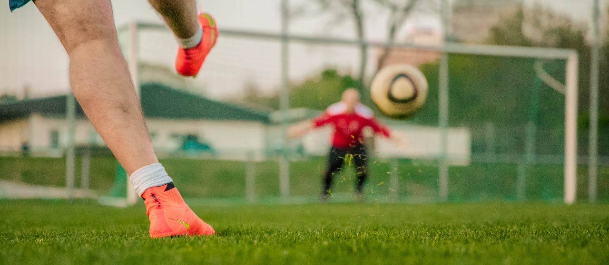

Expected goals (xG) measures the quality of a shot attempt in soccer based on several variables
such as the shot's angle and distance from goal, whether it was a headed
shot or a free kick, etc. Adding up a player or team's xG can give an indication
of how many goals a player or team should have scored on average, given the
shots they have taken. It has become the most used and best understood advanced
metric in the world of football, but training an accurate xG model is not as simple as it
may seem. In series of blog posts, we discuss the technical aspects of data selection, 
feature modelling and model evaluation.



#### HOW DATA AVAILABILITY AFFECTS THE ABILITY TO LEARN GOOD XG MODELS

The available training data can affect the quality of an xG model. This blogpost answers 3 questions: 

- How much data is needed to train an xG model? 
- Does data go out of date? 
- Is there a league-specific effect? 

See the full post at https://dtai.cs.kuleuven.be/sports/blog/how-data-availability-affects-the-ability-to-learn-good-xg-models





#### ILLUSTRATING THE INTERPLAY BETWEEN FEATURES AND MODELS IN XG

The shot's location is among the most important and predictive features in
an xG model. How one should encode this location is not trivial and
requires a good understanding of some key ML concepts.

See the full post at https://dtai.cs.kuleuven.be/sports/blog/illustrating-the-interplay-between-features-and-models-in-xg


